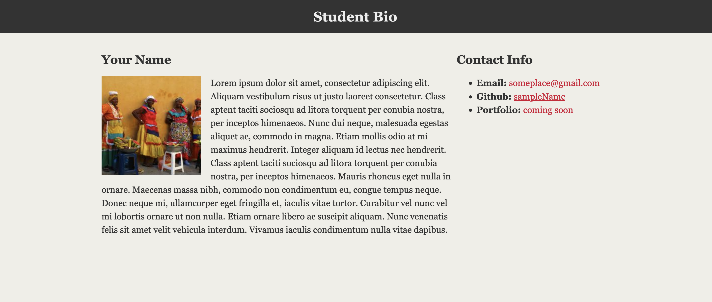

# Student Bio With Style

## Instructions

Open the [Unsolved](Unsolved) folder and use the files inside as a starting point. The goal is 
to style the page using CSS in order to look like the following example:

* Some style specs:
  * `body`
    * The background color is `#efeee7`.
    * The font used `"Georgia", Times New Roman, Times, serif;`.
    * The font color is `#333333`.
    * Be sure to zero out the body margins and padding so the page is flush to the top of the page.
  * `header`
    * The background-color is `#333333`.
  * `h1`
    * The font color is `#eee`.
    * The font size is `28px`.
    * Look at the example on the screen, and eyeball the padding and/or margins and positioning of the text.
  * `h2`
    * The font size is `24px`
  * Make the `main` element have a width of 1024 pixels, and center it. You do this using `margin: 0 auto;`.
  * The `article` element should have a width of `70%`.
  * The `sidebar` element should have a width of `30%`.
  * Links color is `#d21034`.

* Make sure to replace the content inside of the HTML document with your own name, github link, etc.
